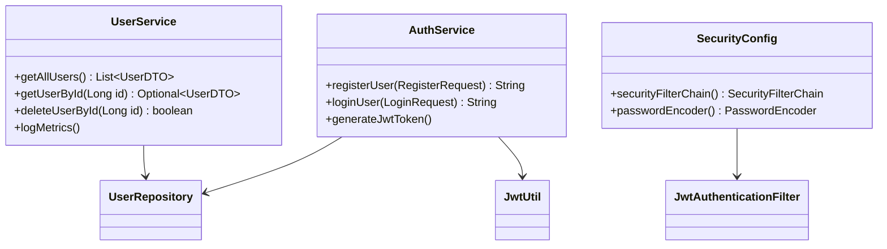

# **📌 Sistema de Usuários - Microsserviço de Autenticação e Gerenciamento**  

**🚀 Microsserviço responsável pelo cadastro, autenticação e gerenciamento de usuários em um sistema de votação distribuído.**  

---

## **📋 Sumário**  
1. [**Visão Geral**](#-visão-geral)  
2. [**Funcionalidades**](#-funcionalidades)  
3. [**Tecnologias Utilizadas**](#-tecnologias-utilizadas)  
4. [**Arquitetura do Serviço**](#-arquitetura-do-serviço)  
5. [**Como Rodar Localmente**](#-como-rodar-localmente)  
6. [**Endpoints da API**](#-endpoints-da-api)  
7. [**Monitoramento e Métricas**](#-monitoramento-e-métricas)  
8. [**Segurança**](#-segurança)  
9. [**Testes Individuais**](#-testes-individuais)  
10. [**Contribuição**](#-contribuição)  
11. [**Licença**](#-licença)  

---

## **🌐 Visão Geral**  
Este microsserviço é parte essencial do **Sistema de Votação em Tempo Real**, responsável por:  
✅ **Cadastro de usuários** (com roles: `USER` e `ADMIN`)  
✅ **Autenticação JWT** (login seguro com tokens)  
✅ **Gerenciamento de usuários** (CRUD completo)  
✅ **Integração com Prometheus** para métricas de performance  

---

## **🛠 Funcionalidades**  
- **Registro de usuários** com validação de e-mail único  
- **Login com JWT** (token válido por 24 horas)  
- **Busca de usuários** por ID ou nome  
- **Deleção de usuários** (restrito a ADMIN)  
- **Métricas em tempo real** (tempo de resposta, contagem de chamadas)  

---

## **⚙ Tecnologias Utilizadas**  
| Categoria       | Tecnologias                                                                 |  
|----------------|-----------------------------------------------------------------------------|  
| **Backend**    | Java 21, Spring Boot 3, Spring Security, JPA/Hibernate                     |  
| **Banco de Dados** | PostgreSQL 15 (Dockerizado)                                              |  
| **Autenticação** | JWT (JSON Web Tokens) + BCryptPasswordEncoder                           |  
| **Monitoramento** | Micrometer, Prometheus, Actuator                                        |  
| **Documentação** | Swagger/OpenAPI                                                         |  
| **Infra**      | Docker, Docker Compose                                                   |  

---

## **🧱 Arquitetura do Serviço**  


---

## **🖥 Como Rodar Localmente**  
### **Pré-requisitos**  
- Docker e Docker Compose instalados  
- Java 21+  
- Maven  

### **Passo a Passo**  
1. **Clone o repositório**  
   ```bash
   git clone https://github.com/SdneyFernandes/voting-system-user-service.git
   cd voting-system-user-service
   ```

2. **Suba os containers** (PostgreSQL + PgAdmin)  
   ```bash
   docker-compose up 
   ``` 

4. **Acesse**  
   - API: `http://localhost:8083`  
   - Swagger: `http://localhost:8083/swagger-ui.html`  
   - PgAdmin: `http://localhost:5050` (credenciais: `admin@admin.com` / `admin`)  

---

## **🔌 Endpoints da API**  
| Método | Endpoint                | Descrição                          | Acesso       |  
|--------|-------------------------|-----------------------------------|-------------|  
| POST   | `/api/users/register`   | Registra um novo usuário          | Público     |  
| POST   | `/api/users/login`      | Gera token JWT                    | Público     |  
| GET    | `/api/users`            | Lista todos os usuários           | ADMIN       |  
| GET    | `/api/users/{id}`       | Busca usuário por ID              | ADMIN       |  
| DELETE | `/api/users/{id}`       | Deleta um usuário                 | ADMIN       |  

**Exemplo de Registro:**  
```json
POST /api/users/register
{
  "userName": "admin",
  "email": "admin@email.com",
  "password": "senha123",
  "role": "ADMIN"
}
```

---

## **📊 Monitoramento e Métricas**  
O serviço expõe métricas via **Prometheus** no endpoint:  
```http
GET /actuator/prometheus
```  
**Métricas coletadas:**  
- `usuario_login_tempo` (tempo médio de login)  
- `usuario_registro_chamadas` (contagem de registros)  
- `usuario_buscar_id_sucesso` (sucesso em buscas por ID)   

---

## **🔐 Segurança**  
- **BCrypt** para hashing de senhas  
- **JWT** com expiração de 24 horas  
- **Roles** (USER/ADMIN) para controle de acesso  
- **Spring Security** com filtros customizados  


---

## **🤝 Contribuição**  
1. Faça um fork do projeto  
2. Crie uma branch:  
   ```bash
   git checkout -b feature/nova-funcionalidade
   ```  
3. Envie um PR com suas alterações  
